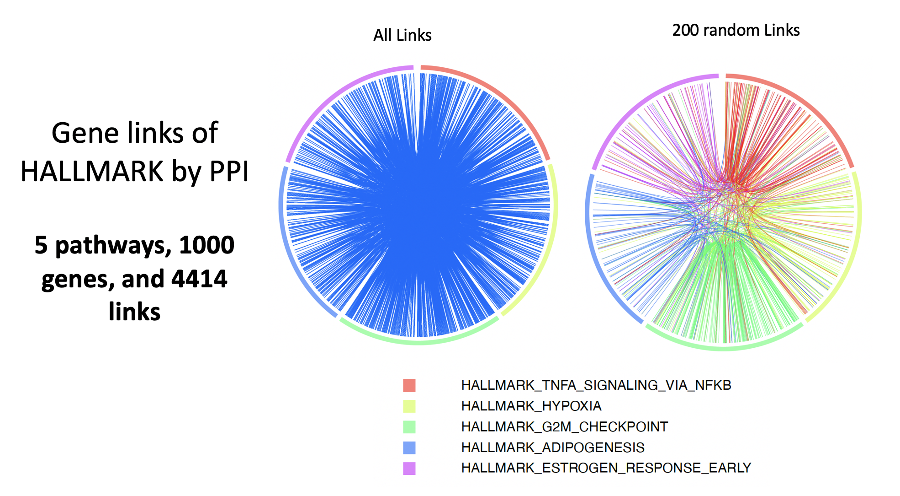

# It is for OmicCircos App

## example 1: circular cluster and heatmap

 

[R codes](examples/do_cluster_circle_test.R)  

 

from left to right:

[R code 1](examples/do_cluster_circle01.R)  [R code 2](examples/do_cluster_circle02.R)   [R code 3](examples/do_cluster_circle03.R)    

## example 2: segment data and gene links by PPI

 

[R codes](examples/do_pathway_link2.R)  
